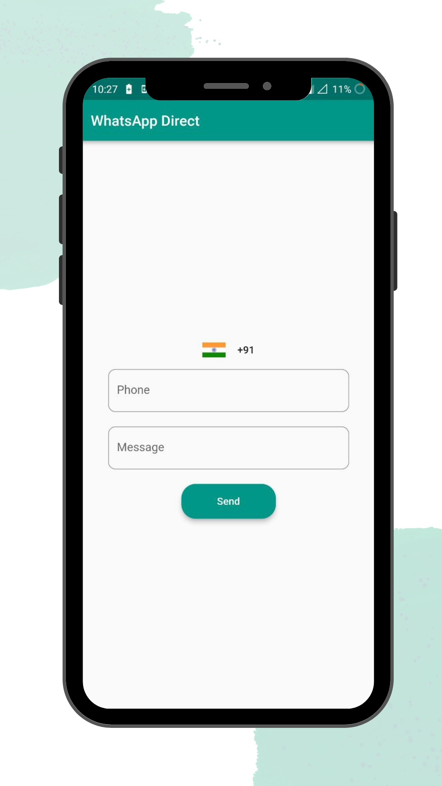
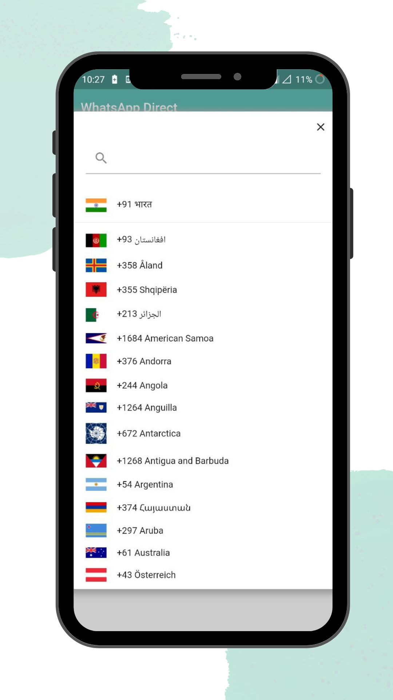

# WHATSAPP DIRECT

Send WhatsApp Messages without saving contact

---

## Installation

PlayStore Link:
https://play.google.com/store/apps/details?id=com.snapsid.whatsapp_chat

---

## ScreenShots

|                                                           |                                                           |
| --------------------------------------------------------- | --------------------------------------------------------- |
|  |   |

---

## Description
Are you one of them who doesn't like to save everyone's WhatsApp contact, especially those which are only needed once?...so that they can't see your profile picture or status, otherwise you need to delete that contact every time.

So to avoid this, you can get the help of this app that will make your work simpler by terminating the need to save and then delete that contact, however, you can still message them. See? Doesn't that sound astonishing? No need to crowd your contacts and allow them to see your personal information, which you don't want them to know but situations make you do so for your work.

For example, you always need to save the WhatsApp number of the printout guy, because that's how they prefer to take the pictures nowadays, for giving out the printout. But mostly it is the case, that we don't want them to see our information on WhatsApp, and thus we need to delete that contact later. But, till how many times we'll be doing it?
Why not make it easier?

---

### :heart: Found this project useful?

If you found this project useful, then please consider giving it a :star: on Github and sharing it with your friends via social media.

---

## Project Created & Maintained By

### Siddharth Chopra

## Getting Started

This project is a starting point for a Flutter application.

- clone repo and setup dart plugin

